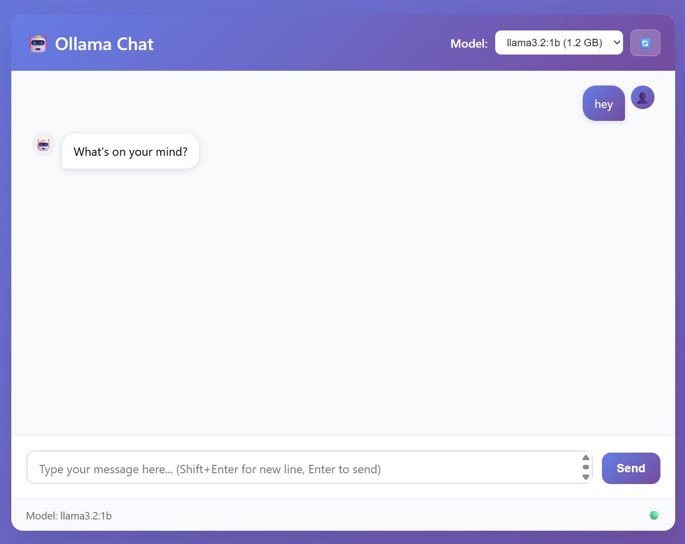
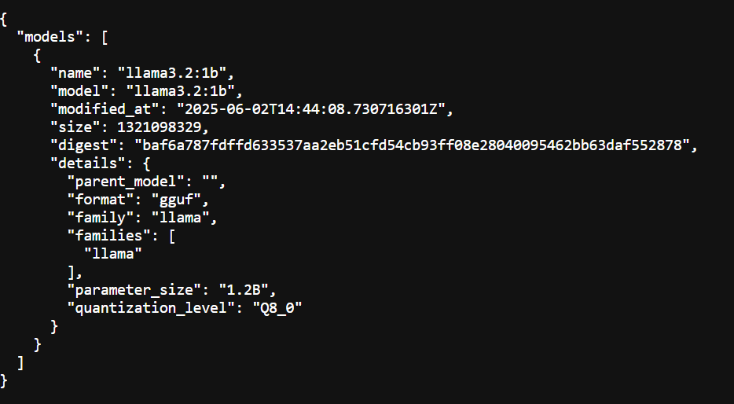
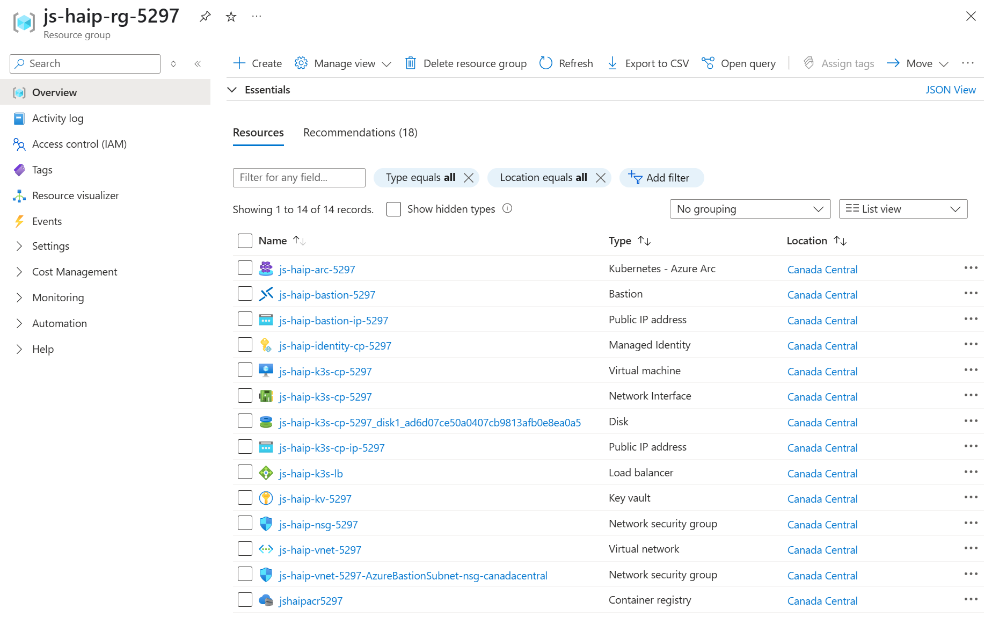

# Hybrid AI Portal (HAIP)

A fully automated, cloud-native LLM web portal powered by Ollama and a web chat UI, deployed on an Azure Arc-enabled K3s cluster.

---

## 📦 Prerequisites

To run the deployment scripts, you need:
- **WSL or Linux** (for Bash script execution)
- **Docker Engine** (or Docker Desktop) to build Ollama API and chat images
- **VS Code** (recommended, but any IDE is fine)
- **Azure Subscription** (all resources will be deployed here)
- **kubectl** (optional, to check K8s resources from your laptop after deployment)
- **Web browser** (e.g., Chrome) to interact with the Ollama chat UI
- **Azure CLI** (authenticate using device code: `az login --use-device-code` is the simplest)
- **Terraform**
- **Git**

---

## 🚀 Quick Start

1. **Clone the repository and move to the project folder:**
   ```bash
   git clone <your-repo-url>
   cd hybrid-ai-portal
   ```
2. **Authenticate with Azure:**
   ```bash
   az login --use-device-code
   ```
3. **Deploy everything (infra + app):**
   ```bash
   ./deploy-ollama.sh all
   ```
   - Provide subscription id where resources will be deployed.
   - End-to-end deployment may take up to 30 minutes, depending on your internet connectivity (Docker images are built and pushed to ACR).

4. **Destroy everything:**
   ```bash
   ./deploy-ollama.sh destroy
   ```

---

## 🏗️ Architecture Overview

- **Default deployment:**
  - Azure VMs: K3s control plane + workers (optional)
  - Llama3.2:1b Ollama model deployed by default
  - Azure Bastion for SSH access to the VM
  - SSH keys stored in Azure Key Vault
  - K3s managed via Azure Arc (bearer token stored in Key Vault)
- **Components:**
  - **K3s Cluster** on Azure VMs (Arc-enabled)
  - **MetalLB** for LoadBalancer IPs
  - **Traefik** as Ingress Controller
  - **Ollama API** and **Web Chat** as Kubernetes Deployments
  - **Azure Container Registry (ACR)** for Docker images
  - **Azure Key Vault** for all the secrets
  - **Azure Bastion** for secure SSH to k3s VMs

Example of Ollama Chart interface (http://<public_ip>/chat).


Example of Ollama API (http://<public_ip>/ollama/api/tags)


Example of deployed Azure resources in the resource group.


---

## ⚙️ Deployment Workflow

- **All infrastructure** is deployed via Terraform. Azure resources parameters can be updated in `terraform.tfvars`
- **K3s** is installed and configured via shell scripts
- **Docker images** for Ollama API and chat are built and pushed to ACR
- **Kubernetes manifests** (YAML) are applied via `kubectl`
- **Ollama API** is accessed via `/api/tags`
- **Web chat** is accessed via `/chat` route

---

## 🌐 Accessing the Portal

- **Traefik LoadBalancer IP**: Assigned by MetalLB (see deployment output)
- **Ingress Routes**:
  - `/ollama` → Ollama API
  - `/chat`   → Web Chat UI
- **No static IPs in docs**: Use the IPs output by the script, or add to `/etc/hosts` as needed.

---

## 🛡️ Robustness & Automation

- All resource names, ports, and manifests are dynamically updated
- MetalLB and Traefik are installed and patched with readiness checks
- Key Vault and Arc proxy waits are robust
- Destroy/apply sequencing is dependency-safe (see Terraform `depends_on`)

---

## 📝 Management

- View pod/service/ingress status:
  ```bash
  kubectl get pods,svc,ingress -A
  ```
- View logs:
  ```bash
  kubectl logs -f deployment/ollama-api
  kubectl logs -f deployment/ollama-chat
  ```
- Scale deployments:
  ```bash
  kubectl scale deployment ollama-chat --replicas=3
  ```
